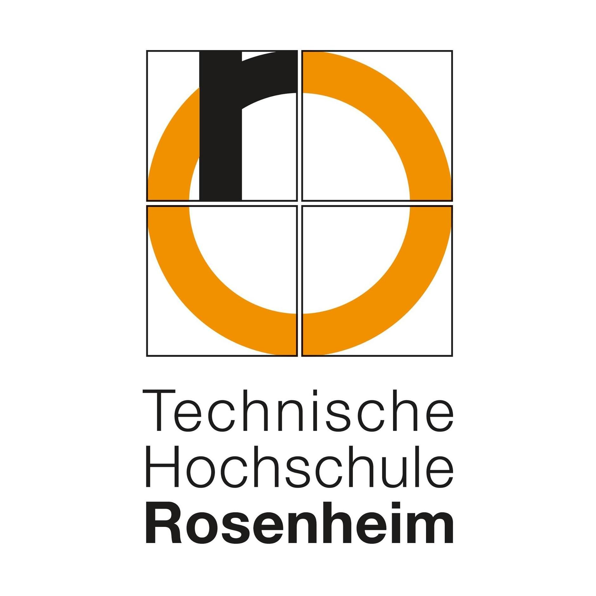
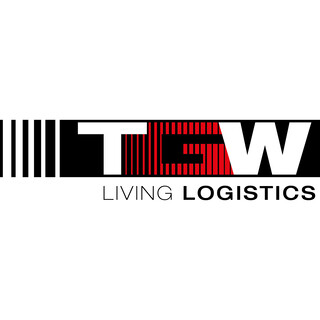
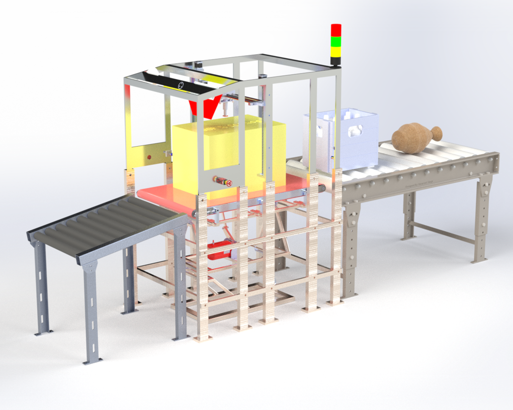

# Teach-In Station: Automated Warehouse Classification System

<p align="center">
  
  
</p>

**Mechanical Design | Summer Semester 2024** **Technische Hochschule Rosenheim | Group D** *In collaboration with TGW Logistics Group GmbH*

---

## 🏛️ Project Context
This project was developed as part of the **Mechanical Design** curriculum at **TH Rosenheim** for the Summer Semester 2024. The design was created in direct collaboration with **TGW Logistics Group GmbH** to solve real-world challenges in automated logistics.

## 📝 Project Overview
The "Teach-In Station" is an innovative solution designed to automate the identification of product attributes. Unlike standard systems that only track barcodes, this station analyzes:
<p align="center">
  
</p>  
* **Physical Dimensions & Shape:** Identifying "Regular" vs. "Ugly" (irregular) objects using 3D camera profiling.
* **Stiffness:** Measuring structural integrity via a custom probe mechanism ($F = k \cdot \delta$).
* **Material Properties:** Detecting center of mass, liquid content (sloshing detection), and friction coefficients.

## 🛠️ System Assemblies
The repository contains design data for the following core modules:
1. **/Cage-Assembly:** The main structural frame housing the 3D camera, ultrasonic sensors, and weighing system.
2. **/Stiffness-Mechanism:** Precision assembly utilizing stepper motors, lead screws, and load cells for pressure testing.
3. **/Swivelling-Table:** A tilting platform designed for center of mass calculation and liquid detection.
4. **/Gravity-Conveyor:** The sorting mechanism for final product distribution.

## 📊 Technical Specifications
* **Final Concept:** Concept 7 (Selected for high reliability and space efficiency).
* **Total Estimated Cost:** **€9,118.76** (Budget limit: €15,000.00).
* **Software Logic:** Implementation of the **TGW Decision Code** (evaluating Weight, Dimensions, Geometry, and Stiffness).
* **Safety:** Integrated emergency stop, smoke detection, and optimized LED lighting for sensor precision.

## 👥 Group D Team Members
* Ajumal Shamsudeen 
* Aniket Barotkar
* Azmath Dar Khan
* Francis Almeida
* Udit Kumar
* Yazmin Soto

---

## 📂 Repository Structure
```text
├── docs/                 # Final Report and Technical Documentation
├── cad-models/           # STEP/STL files for all assemblies
├── simulations/          # Ansys FEA study results
├── logic/                # TGW Decision Code flowcharts and scripts
└── README.md             # Project Overview
